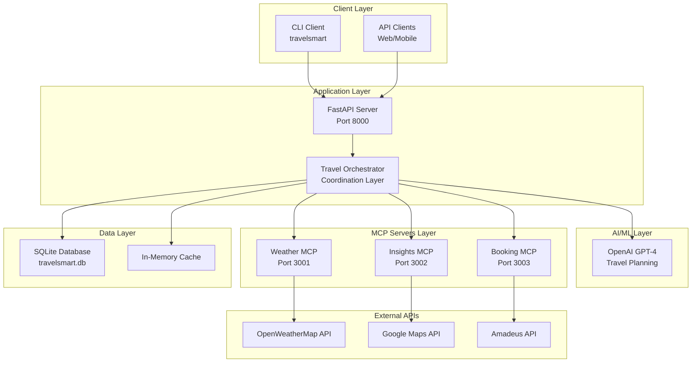

# TravelSmart  - App - Idea Concept🌍✈️

An AI-powered travel booking application that combines OpenAI GPT with Model Context Protocol (MCP) servers to provide intelligent travel planning, weather insights, and booking capabilities.

## Overview

TravelSmart is a comprehensive travel planning system that leverages artificial intelligence to provide personalized travel recommendations, real-time weather data, and seamless booking capabilities. The system uses a microservices architecture with MCP (Model Context Protocol) servers to handle different aspects of travel planning.

## Features

- **AI-Powered Planning**: Uses OpenAI GPT-4 for intelligent travel recommendations
- **Weather Integration**: Real-time weather data and forecasts via MCP server
- **Travel Insights**: Destination information, attractions, and local tips
- **Booking System**: Flight and hotel search and booking via MCP server
- **RESTful API**: FastAPI-based web service with comprehensive endpoints
- **CLI Interface**: Command-line tool for quick travel planning
- **Async Architecture**: High-performance async/await implementation
- **Poetry Integration**: Modern Python dependency management with pyproject.toml

## High-Level Design (HLD)

### System Architecture Overview



### Technology Stack

| Layer | Technologies |
|-------|-------------|
| **Frontend** | CLI (Click), REST API (FastAPI) |
| **Backend** | Python 3.10+, FastAPI, Uvicorn |
| **AI/ML** | OpenAI GPT-4 API |
| **Communication** | MCP (Model Context Protocol), HTTP/REST |
| **Database** | SQLite (Development), PostgreSQL (Production) |
| **Dependencies** | Poetry, pyproject.toml |
| **Logging** | Loguru |
| **Testing** | Pytest, pytest-asyncio |
| **External APIs** | OpenWeatherMap, Google Maps, Amadeus |

### Key Components

1. **Travel Orchestrator**: Central coordination layer that manages all travel-related operations
2. **GPT Service**: Integration with OpenAI GPT-4 for intelligent travel planning
3. **MCP Servers**: Specialized microservices for weather, insights, and booking operations
4. **FastAPI Application**: RESTful web service providing HTTP endpoints
5. **CLI Interface**: Command-line tool for developers and power users

## Installation

### Prerequisites

- Python 3.10+
- Poetry (for dependency management)
- OpenAI API key

### Setup

1. Clone the repository:
```bash
git clone https://github.com/nithinmohantk/TravelSmart-App-Concept.git
cd TravelSmart
```

2. Install dependencies with Poetry:
```bash
export PATH="/home/nithinmohantk/.local/bin:$PATH"
poetry install
```

3. Set up environment variables:
```bash
cp .env.example .env
# Edit .env with your API keys
```

4. Required environment variables:
```env
OPENAI_API_KEY=your_openai_api_key_here
WEATHER_API_KEY=your_openweathermap_api_key_here
GOOGLE_MAPS_API_KEY=your_google_maps_api_key_here
```

## Usage

### Start All Services

```bash
poetry run travelsmart-server
```

This starts:
- Main API server (port 8000)
- Weather MCP server (port 3001) 
- Travel Insights MCP server (port 3002)
- Booking MCP server (port 3003)

### CLI Usage

Plan a trip:
```bash
poetry run travelsmart plan \
  --destination "Paris" \
  --departure "New York" \
  --start-date "2026-06-15" \
  --end-date "2026-06-22" \
  --budget 2000 \
  --travel-type leisure \
  --party-size 2
```

Get weather forecast:
```bash
poetry run travelsmart weather --destination "Paris"
```

Get travel insights:
```bash
poetry run travelsmart insights --destination "Tokyo"
```

### API Usage

Once the server is running, visit:
- API Documentation: http://localhost:8000/docs
- Health Check: http://localhost:8000/health

Example API request:
```bash
curl -X POST "http://localhost:8000/plan-trip" \
  -H "Content-Type: application/json" \
  -d '{
    "destination": "Paris",
    "departure_city": "New York", 
    "start_date": "2026-06-15",
    "end_date": "2026-06-22",
    "budget": 2000,
    "travel_type": "leisure",
    "party_size": 2
  }'
```

## API Endpoints

- `GET /` - Welcome message
- `GET /health` - Health check
- `POST /plan-trip` - Plan a complete trip with AI
- `POST /book-trip` - Book flights and hotels
- `GET /destinations/{destination}/weather` - Get weather forecast
- `GET /destinations/{destination}/insights` - Get travel insights

## MCP Servers

### Weather Server (Port 3001)
- `get_weather_forecast` - Weather forecast for date range
- `get_current_weather` - Current weather conditions

### Travel Insights Server (Port 3002) 
- `get_destination_insights` - Comprehensive destination info
- `get_attractions` - Popular attractions and activities
- `get_restaurants` - Restaurant recommendations

### Booking Server (Port 3003)
- `search_flights` - Flight search and options
- `search_hotels` - Hotel search and options  
- `book_trip` - Complete trip booking

## Development

### Run Tests
```bash
poetry run pytest
```

### Code Formatting
```bash
poetry run black src/
poetry run ruff check src/
```

### Type Checking
```bash
poetry run mypy src/
```

## Project Structure

```
TravelSmart/
├── src/travelsmart/
│   ├── __init__.py
│   ├── config.py              # Configuration settings
│   ├── cli.py                 # CLI interface
│   ├── server.py              # Server runner
│   ├── api/
│   │   └── main.py            # FastAPI application
│   ├── models/
│   │   ├── __init__.py
│   │   └── travel_models.py   # Data models
│   ├── services/
│   │   ├── __init__.py
│   │   ├── gpt_service.py     # OpenAI GPT integration
│   │   ├── mcp_client.py      # MCP client
│   │   └── travel_orchestrator.py  # Main orchestrator
│   └── mcp_servers/
│       ├── weather_server.py      # Weather MCP server
│       ├── travel_insights_server.py  # Insights MCP server
│       └── booking_server.py       # Booking MCP server
├── tests/
├── examples/
├── docs/
├── pyproject.toml
├── README.md
└── .env.example
```

## Contributing

1. Fork the repository
2. Create a feature branch
3. Make your changes
4. Add tests
5. Run the test suite
6. Submit a pull request

## License

This project is licensed under the MIT License - see the LICENSE file for details.

## Support

For support, please open an issue on GitHub or reach out via the repository discussions.
